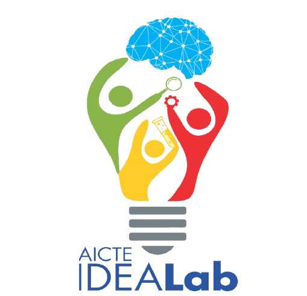
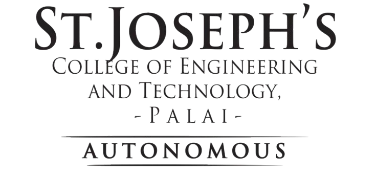

<div align="center">
  
  
  <h1>SJCET IDEALab Web Portal</h1>
  <p>Official web portal for the AICTE IDEALab at St. Joseph's College of Engineering and Technology, Palai</p>
</div>

---

## 🚀 Features

- 🏠 **Home** — Overview of the lab with stats and featured equipment
- 🏫 **About** — About SJCET and the AICTE IDEALab collaboration
- 🛠️ **Facilities** — Browse all lab equipment with specs and safety rules
- 📅 **Workshops & Events** — View and register for upcoming events
- 📋 **My Bookings** — Book equipment slots and track reservations
- 📞 **Contact** — Send inquiries and view FAQs

## 🛠️ Tech Stack

- **React 19** + **TypeScript**
- **Vite** (build tool)
- **Tailwind CSS v4** (styling)
- **Framer Motion** (animations)
- **Lucide React** (icons)

## 💻 Run Locally

**Prerequisites:** Node.js (v18 or above)

1. Clone the repository:
   ```bash
   git clone https://github.com/Alex-S07/sjcet-idealab.git
   cd sjcet-idealab
   ```

2. Install dependencies:
   ```bash
   npm install
   ```

3. Run the development server:
   ```bash
   npm run dev
   ```

4. Open your browser at `http://localhost:3000`

> **No API key required.** This project runs fully offline with local data and images.

## 📁 Project Structure

```
sjcet-idealab/
├── public/
│   └── images/          # All local images (logos, equipment photos)
├── src/
│   ├── components/      # Page components (Home, About, Facilities, etc.)
│   ├── App.tsx          # Main app with navigation
│   ├── mockData.ts      # Equipment, events, and FAQ data
│   └── types.ts         # TypeScript type definitions
├── index.html
└── package.json
```

## 🏫 About

This portal was developed for **SJCET IDEALab, Palai** — an AICTE-funded Innovation, Design, Entrepreneurship and Application Lab fostering hands-on engineering education.

© 2026 SJCET IDEALab Palai. All rights reserved.
